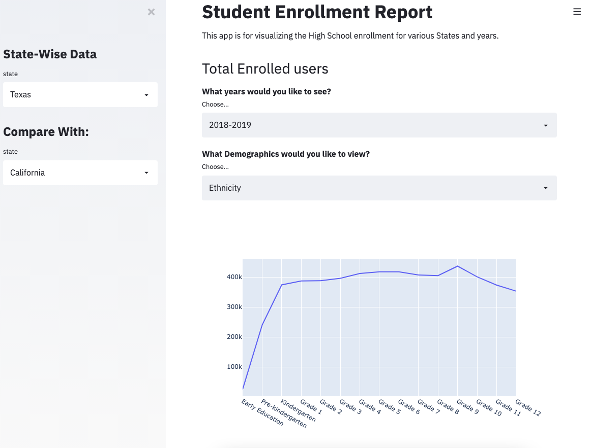

# Dashboards
There are various dashboarding tools and experiences, below are a few mockups 


## Streamlit Dashboard High School Enrollment
Read more about streamlit here https://www.streamlit.io/ 

Basically this will allow us to deploy our plots in a website that is interactive. 

Todo: Scope out the details of this dashboard. 

To run:
```
streamlit run  interactive_streamlit.py
```
